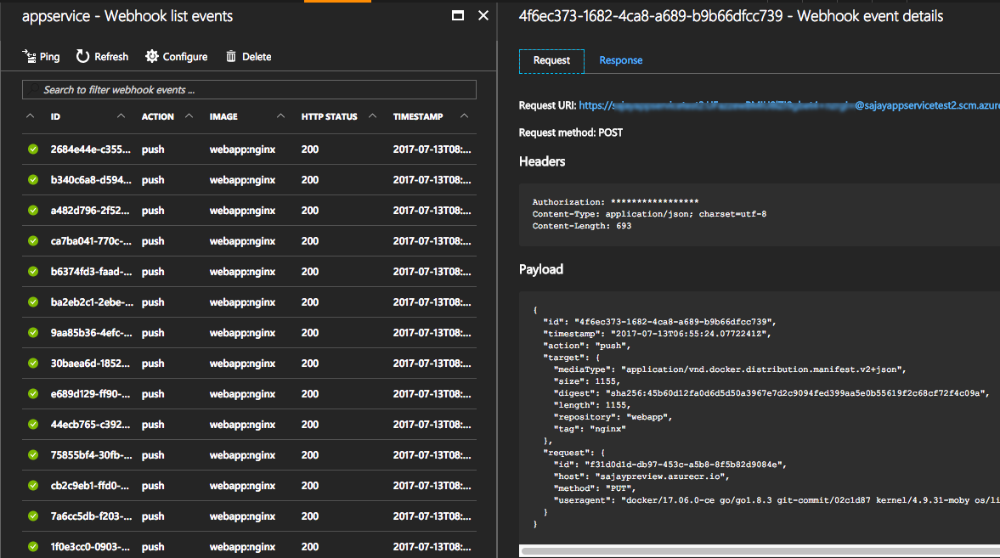

# AppService with ACR integration

Azure Container Registry webhooks can be used to automatically update your application running on Azure App Services that run your container applications. 

1. Setup your image to deploy to your Azure Web App on Linux as per the instruction at [https://docs.microsoft.com/en-us/azure/app-service-web/app-service-linux-using-custom-docker-image#how-to-use-a-docker-image-from-a-private-image-registry](https://docs.microsoft.com/en-us/azure/app-service-web/app-service-linux-using-custom-docker-image#how-to-use-a-docker-image-from-a-private-image-registry)

2. In the App Settings section of your Web Application, add an app setting called `DOCKER_ENABLE_CI` with the value `true`.

3. Create a web hook in your registry and provide the docker callback uri which is of the form `https://<publishingusername>:<publishingpwd>@<sitename>.scm.azurewebsites.net/docker/hook` 
> Authorization Header is not currently being passed to the target service and needs to be **_manually added_** in the web hook as a temporary work around.

